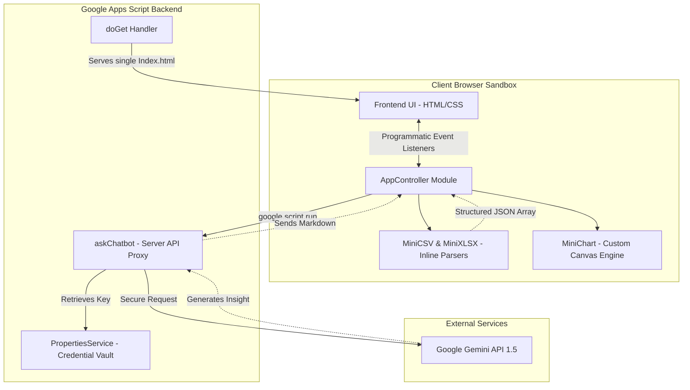

# System Architecture: HR Ecosystem

The HR Ecosystem Portal utilizes a serverless, decoupled architecture running entirely within the Google Apps Script infrastructure and the client browser.

## Component Block Diagram

## Core Modules

1. **Client Interface (`Index.html`)**
   - **Styling Layer**: Built with raw CSS using dynamic HSL color mappings, glassmorphism card elevation properties, and grid styles for charts and metric indicators.
   - **Inline Parsers (`MiniCSV`, `MiniXLSX`)**: Custom-built, lightweight parsing utilities developed in plain ES5 JavaScript to process raw files without downloading external CDN dependencies.
   - **Canvas Chart Engine (`MiniChart`)**: An inline vector-drawing class that reads parent client dimensions to resize graphs on high-DPI displays. Supports horizontal department bars, gender doughnuts, and compensation lines.
   - **AppController**: The orchestrator maintaining in-memory session state (`_dataset`, `_aiContextStr`). It attaches all UI event listeners programmatically, decoupling handlers from markup.

2. **Apps Script Backend (`Code.js`)**
   - **`doGet`**: Serves the Single-Page Application (SPA) in high-compatibility `IFRAME` sandbox mode, adding viewport responsive tags.
   - **`askChatbot`**: Acts as a secure middleware proxy. It reads the Gemini API key from Google's properties service, builds the analytical system prompt, forwards queries along with context vectors, and streams answers back.
