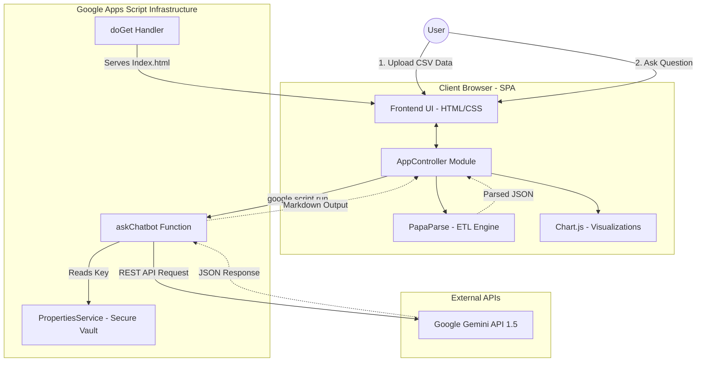

# Architecture Overview

The HR Analytics AI Hub utilizes a serverless, decoupled architecture running entirely within the Google Apps Script ecosystem and the user's browser.

## System Architecture Diagram

## Components

1. **Client Browser (SPA)**
   - The user interface is completely served as a single HTML payload via `Index.html`.
   - **AppController**: An encapsulating JavaScript module that holds the application state in-memory (`_dataset`, `_aiContextStr`). It acts as the orchestrator for the entire application.
   - **PapaParse**: Used for client-side CSV parsing. Raw user data remains strictly in the browser during the ingestion phase.

2. **Google Apps Script Backend (`Code.js`)**
   - Contains minimal business logic, acting primarily as a secure proxy and server.
   - **PropertiesService**: Securely stores the `GEMINI_API_KEY` as a project property, preventing credential leaks in the source repository.
   - **UrlFetchApp**: Used by the backend to securely communicate with the Google Gemini API without exposing the API key to the client's browser.

3. **Gemini API**
   - Receives the aggregated data context generated by the client alongside the user's query, responding with deep analytical insights formatted in Markdown.
