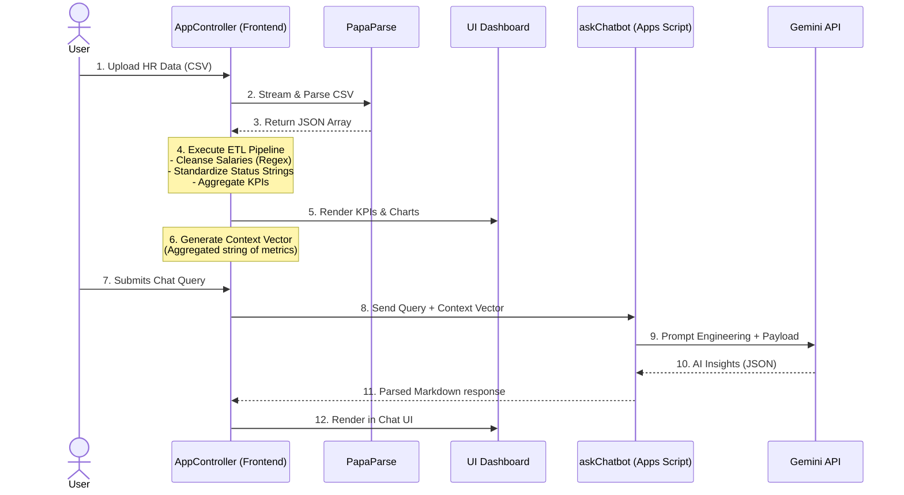

# Data Flow & ETL Pipeline

Because HR data is inherently sensitive (PII, salaries, termination status), this project completely avoids storing raw data in a database. All processing, cleansing, and aggregation occurs strictly in-memory within the client's browser.

## ETL Process Diagram

## Privacy & Security Strategy

At no point is the raw CSV data array sent to the Gemini API or the Google Apps Script backend. 

The pipeline works as follows:
1. **Extract**: PapaParse streams the CSV file locally from the user's machine.
2. **Transform**: The `AppController` standardizes column headers dynamically (e.g., matching "Pay", "Salary", "Compensation"), cleanses string currency into floats, and computes standard active vs. terminated states.
3. **Load**: The data is loaded into an in-memory variable `_dataset`.
4. **Aggregation**: The AppController calculates summary aggregations (e.g., total headcount, averages, demographic distributions).
5. **Context Vector**: A string called `_aiContextStr` is generated, summarizing the data (e.g., *"Total Historical Employees: 1500. Current Active: 1200. Attrition Rate: 20%. Company Avg Salary: $85,000..."*).
6. **Transmission**: Only the `_aiContextStr` (aggregated, non-PII summary) and the User's text query are transmitted over the network for AI analysis.
