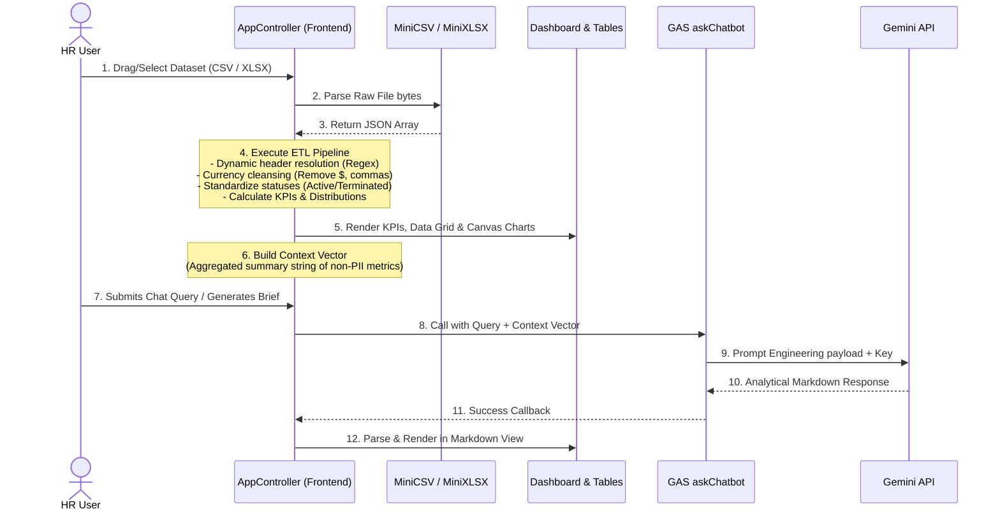

# Data Flow & ETL Pipeline

Because workforce databases contain sensitive details (compensation rates, employee IDs, genders, and statuses), the HR Ecosystem Portal utilizes a zero-storage data policy. All cleaning, transformation, and visualizations occur strictly within the client browser's sandbox.

## ETL Process sequence

## Security & Data Integrity

1. **Extract**: The user selects a document. The client-side parser reads file content in-memory as an ArrayBuffer or Text stream.
2. **Transform**: The `AppController` runs mapping logic:
   - Matches keys like "pay", "wage", or "compensation" to standardized `salary` values.
   - Cleanses string text like `"$120,000.50"` into numeric floats (`120000.5`).
   - Normalizes statuses (e.g. "Terminated", "Resigned", "Inactive" map to `"Terminated"`).
   - Filters out corrupt or blank dataset rows.
3. **Load**: Data is saved to local runtime state `_dataset`.
4. **Aggregation**: Key indicators are synthesized:
   - Attrition rates by dividing terminated headcount by historical total headcount.
   - Gender pay gap benchmarks.
5. **Context Vector Generation**: Aggregated stats are converted to a text summary vector. Raw employee names, IDs, or exact individual records are never appended, ensuring absolute privacy.
6. **AI Dispatch**: Only the summary vector is sent to the backend proxy.
